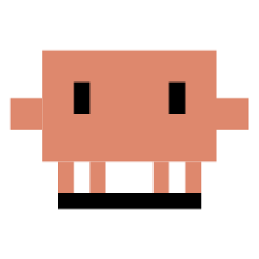

<div align="center">



# Clawd

**A cute pixel-art desktop pet for Windows.**
Inspired by Shimeji — a small crab named Clawd lives on your desktop, walks across your screen, climbs your application windows, and eats files you drag onto him (sending them safely to the Recycle Bin).

[](https://tauri.app)
[](https://www.rust-lang.org)
[](#)
[](#install)

</div>

---

## Showcase

<table align="center">
  <tr>
    <td align="center">
      <br/>
      <sub><b>Idle</b></sub>
    </td>
    <td align="center">
      <br/>
      <sub><b>Walking</b></sub>
    </td>
    <td align="center">
      <br/>
      <sub><b>Happy</b></sub>
    </td>
    <td align="center">
      <br/>
      <sub><b>Working</b></sub>
    </td>
    <td align="center">
      <br/>
      <sub><b>Sleeping</b></sub>
    </td>
  </tr>
</table>

23 hand-crafted pixel-art animations — open the SVG files in `src/assets/` to see them animate.

---

## Features

- **Always-on-top transparent pet** — sits on your desktop without a window frame.
- **Mouse interaction** — click to make Clawd happy, drag to move him around, eyes follow your cursor when nearby.
- **Window climbing** *(Shimeji-style)* — Clawd walks up the sides of any open application window, walks along the top edge, then turns the corner and climbs back down.
- **Screen edge climbing** — climbs the left/right monitor edges and walks back across the top.
- **File eater** — drag any file/folder onto Clawd and it gets moved to the Recycle Bin (safe, recoverable).
- **Auto-cycle idle states** — Clawd randomly switches between walking, working, sleeping, etc. when idle.
- **Multi-monitor + HiDPI aware** — pet positions correctly across monitors with different DPI scaling (100%, 150%, 200%).
- **Tray menu** — Show / Hide / Force Sleep / Wake Up / Reset Position / Exit.
- **Single instance** — running Clawd a second time just focuses the existing one.

---

## Install

### Option 1 — Pre-built installer (easiest)

Grab the latest release from the **[Releases page](https://github.com/Hert4/clawd-window/releases)** and run one of:

| File | Type | Size | Notes |
|---|---|---|---|
| `clawd_0.1.0_x64-setup.exe` | NSIS installer | ~1.9 MB | Recommended |
| `clawd_0.1.0_x64_en-US.msi` | MSI installer | ~2.9 MB | For enterprise / silent install |

> Windows SmartScreen may warn the binary isn't signed — click **More info → Run anyway**.

### Option 2 — Build from source

See [Build from source](#build-from-source) below.

---

## Usage

After install, **Clawd** appears as a floating crab near the bottom-right of your screen and as a tray icon in the system tray.

| Action | Result |
|---|---|
| **Click** Clawd | Plays happy animation |
| **Drag** Clawd | Move him anywhere on screen |
| **Drop file** on Clawd | File moves to Recycle Bin (Clawd eats it!) |
| **Right-click** tray icon | Open menu (Show/Hide/Sleep/Reset/Exit) |
| Move cursor near Clawd | Eyes track your cursor |
| Leave Clawd alone | Auto-cycles through animations; sleeps after ~5 min idle |
| Walk into a window edge | Clawd climbs it, walks across the top, climbs down the other side |

---

## Build from source

### Prerequisites

- **Windows 10/11** (64-bit)
- **[Rust](https://rustup.rs)** ≥ 1.77 (`rustup default stable`)
- **[Microsoft C++ Build Tools](https://visualstudio.microsoft.com/visual-cpp-build-tools/)** — required for linking on Windows
- **[WebView2 Runtime](https://developer.microsoft.com/en-us/microsoft-edge/webview2/)** — pre-installed on Windows 11

Verify:
```powershell
rustc --version    # 1.77 or newer
cargo --version
```

### Clone & install Tauri CLI

```powershell
git clone https://github.com/Hert4/clawd-window.git
cd clawd-window
cargo install tauri-cli --version "^2.0" --locked
```

### Run in dev mode

```powershell
cargo tauri dev
```

First build takes ~5 minutes (compiling Tauri + dependencies). Subsequent runs are fast — Tauri auto-reloads on file changes.

### Build a release installer

```powershell
cargo tauri build
```

The build produces two installers in `src-tauri/target/release/bundle/`:

```
src-tauri/target/release/bundle/
├── msi/clawd_0.1.0_x64_en-US.msi      # MSI for enterprise / silent install
└── nsis/clawd_0.1.0_x64-setup.exe     # NSIS installer (recommended)
```

Both come with a multi-resolution icon (16/24/32/48/64/128/256) embedded in the `.exe`, so the Start Menu / Desktop shortcut shows Clawd at every DPI.

### Regenerate icons (optional)

If you change `src-tauri/icons/icon-source.png`, regenerate all sizes + the `.ico`:

```powershell
cargo tauri icon src-tauri/icons/icon-source.png
```

---

## Project structure

```
clawd-window/
├── src/                              # Frontend (vanilla HTML/CSS/JS)
│   ├── index.html                    # <object> tag swaps SVG per state
│   ├── pet.js                        # State listener, drag/click, eye-tracking
│   ├── style.css                     # Transparent body, pixelated rendering
│   └── assets/                       # 23 hand-crafted SVG animations
│
├── src-tauri/                        # Backend (Rust)
│   ├── src/
│   │   ├── lib.rs                    # App entry, plugin setup, command registration
│   │   ├── main.rs                   # Binary entry
│   │   ├── state.rs                  # PetState enum + Arc<RwLock>
│   │   ├── pet_controller.rs         # Walking, climbing, gravity tick (60 Hz)
│   │   ├── window_tracker.rs         # Win32 EnumWindows polling
│   │   ├── file_eater.rs             # trash crate -> Recycle Bin
│   │   └── tray.rs                   # Tray icon + menu
│   ├── icons/                        # App icons (PNG + ICO + ICNS)
│   ├── Cargo.toml                    # Rust dependencies
│   └── tauri.conf.json               # Window/bundle config
│
└── assest/                           # Original SVG sources (kept for reference)
```

---

## Tech stack

| Layer | Tech |
|---|---|
| Window / runtime | [Tauri 2.10](https://tauri.app) — Rust backend + WebView2 frontend |
| Backend language | [Rust 2021](https://www.rust-lang.org) |
| Frontend | Vanilla HTML/CSS/JS (no bundler) |
| Pet rendering | SVG with `@keyframes` CSS animations, swapped via `<object data>` to avoid CSS scope collisions |
| Win32 integration | [`windows-rs`](https://crates.io/crates/windows) — `EnumWindows`, `MonitorFromPoint`, `GetMonitorInfoW`, `DwmGetWindowAttribute` |
| File deletion | [`trash`](https://crates.io/crates/trash) — moves to Recycle Bin (recoverable) |
| Async runtime | [`tokio`](https://tokio.rs) |
| State sync | [`parking_lot::RwLock`](https://crates.io/crates/parking_lot) wrapped in `Arc` |

---

## How the climbing logic works

Every 16 ms, the walker tick:

1. Reads pet's current position and the monitor's work area (`MonitorFromPoint` + `GetMonitorInfoW`, properly handling multi-DPI).
2. Detects which `PetState` it's in (Walking / Climbing / Falling / Idle / …).
3. **Walking**: moves pet horizontally; if pet's right edge touches the left edge of an open window, transitions to `Climbing { hwnd, edge: Left }` and applies gravity = false.
4. **Climbing**: moves pet vertically along the window's edge. When pet reaches the top, runs a 14-tick lateral interpolation (`corner_turn`) so the pet smoothly walks onto the top of the window, then transitions back to `Walking` along the top.
5. **Window destroyed** while climbing: pet falls back to the floor.
6. **Gravity**: when no edge/wall is grabbed, pet falls toward the nearest floor — either screen taskbar top, or the top of any window the pet is centered over.

All measurements use **physical pixels** from `outer_size()` so positioning stays correct when the pet crosses monitors with different DPI scaling.

---

## License

This project is provided as-is. The Clawd character pixel-art SVGs in `src/assets/` are the original work of the project author.

---

<div align="center">
<sub>Made with Tauri · Rust · WebView2</sub>
</div>
